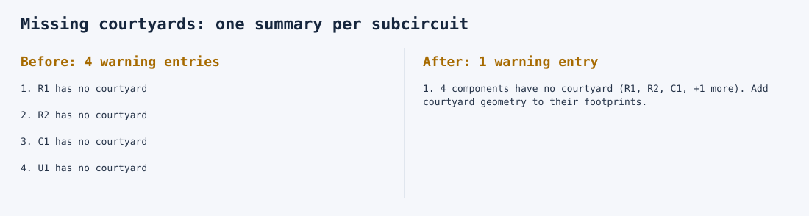

# Missing-courtyard warning consolidation

Missing courtyards are grouped by subcircuit. Overlap, clearance, and other placement diagnostics remain separate. The fixture shows four missing courtyards becoming one summary.

`runAllPlacementChecks` enables this by default, so `runAllChecks` also returns summaries.
Call `runAllPlacementChecks(circuitJson, { consolidateMissingCourtyards: false })` for the original entries, or call the individual checks directly.
The exported `consolidateMissingCourtyardWarnings(circuitJson, warnings)` helper can also be applied to combined diagnostic lists.

Summaries retain an existing Circuit JSON warning type. The exported `ConsolidatedMissingCourtyardWarning` type adds `related_warnings` containing every original diagnostic. It also retains `pcb_component_ids` and `source_component_ids` for navigation. Singletons are returned unchanged; applying consolidation twice is safe and inputs are not mutated. Fatal and nonfatal records are never combined.

The singular component ID identifies the representative warning; consumers that want to highlight every affected location should use the plural IDs or `related_warnings`. These are checks-specific extension fields, like the existing overlap consolidator's `related_errors`, and are not declared in the upstream Circuit JSON schema. Consumers that strip unknown fields must request raw output or preserve the extensions. A console can print the summary immediately, but expandable UI requires consumer support. Count original findings through `related_warnings?.length ?? 1`, rather than treating the returned array length as the original finding count.



The snapshot is generated from actual check output, not hand-written example messages. Regenerate with:

```sh
BUN_UPDATE_SNAPSHOTS=1 bun test tests/lib/consolidate-missing-courtyard-warnings.test.ts
```
