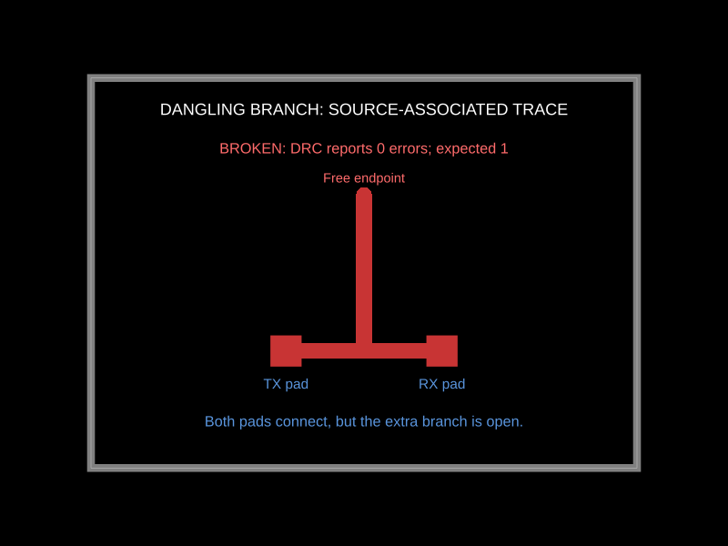
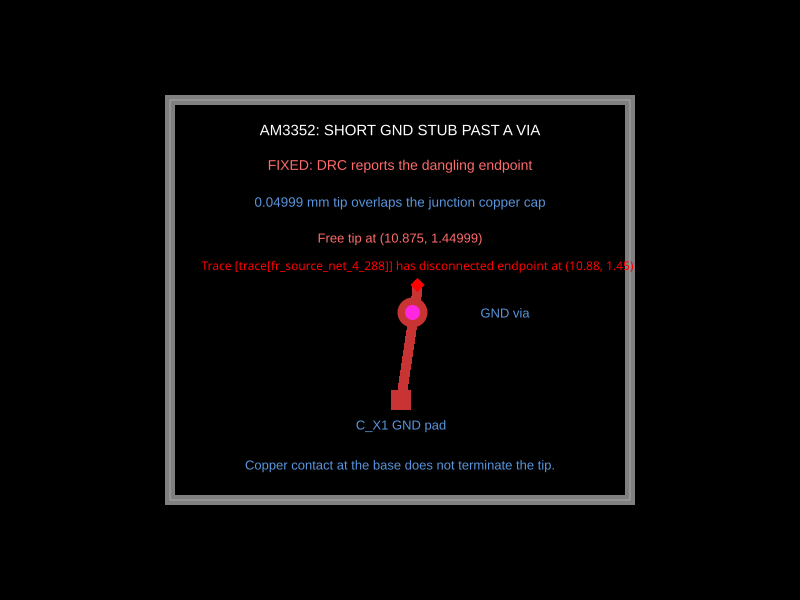

# Dangling trace DRC: fixed behavior

These snapshot reproductions explain two missed dangling-endpoint errors and verify the fix. The [baseline PR](https://github.com/tscircuit/checks/pull/322) records zero errors for these same circuits. Each updated test now requires one error at the exposed endpoint, and its snapshot shows the DRC marker and message.

## A branch on a source-associated trace

Both required pads connect through the main trace. A second fragment with the same `source_trace_id` branches upward and ends in free space. Previously, required-port validation skipped subsequent fragments, and floating-endpoint validation excluded traces with expected ports. Required-port checks still run once per source trace, but endpoint checks now run on each applicable fragment.



## The short ground stub from the AM3352 board

The published [AM3352 development board](https://tscircuit.com/seveibar/am3352-dev-board-4layer-dogbone#pcb) contains a GND trace extending past a via at `(10.825, 1.175)` mm. Its final 0.04999 mm segment ends at `(10.875, 1.44999)` mm. Its copper overlaps the preceding trace's rounded cap, which previously hid the exposed tip. The checker now distinguishes contact at the inward branch junction from contact that actually terminates the exposed endpoint.

This fixture preserves the two top-layer trace fragments and via coordinates, with a simplified terminal pad. It deliberately omits expected ports to isolate the short-stub problem from the source-attribution problem above. The nearby crystal pad is on another net; connecting the tip to it is not a fix.



All coordinates are board/world points in millimeters: +X right, +Y top, +Z above, right-handed. Both snapshots contain their own explanatory text so they can be reviewed without this document.

The fix preserves valid pad, via, same-net/layer copper-pour, and trace-junction contacts. Pour holes remain nonconductive. Via-only fragments retain their existing connectivity validation.

Run both reproductions:

```sh
bun test tests/lib/check-traces-are-contiguous-dangling-port-branch.test.ts tests/lib/check-traces-are-contiguous-short-dangling-stub.test.ts
```
