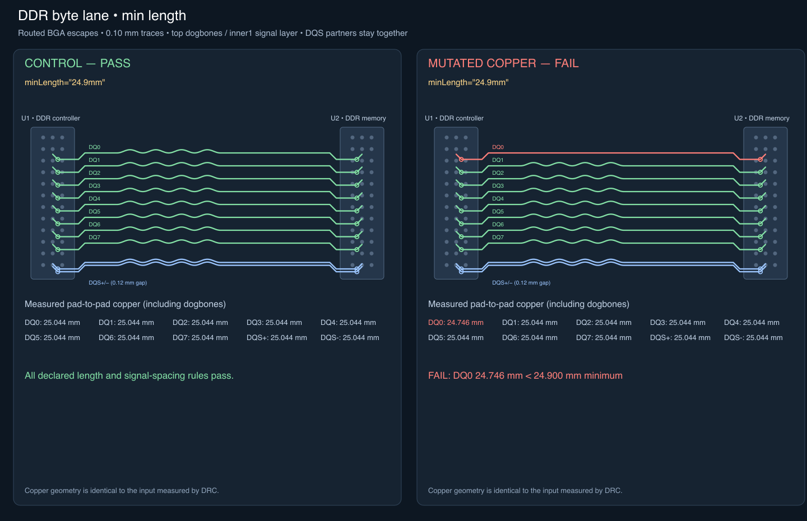
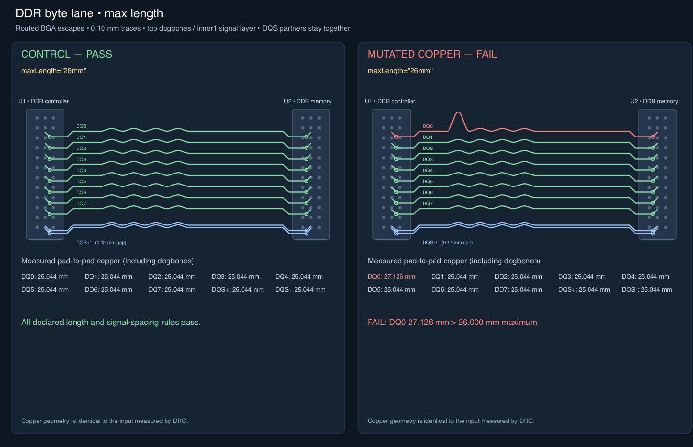
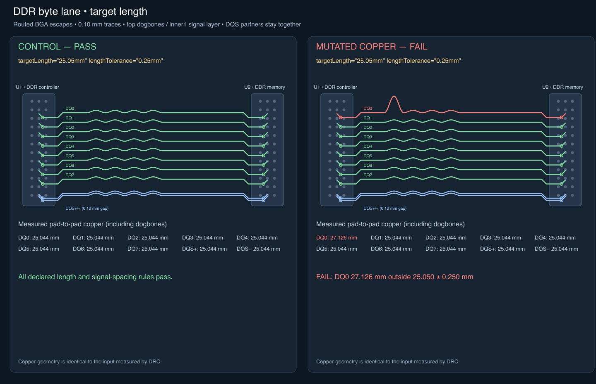
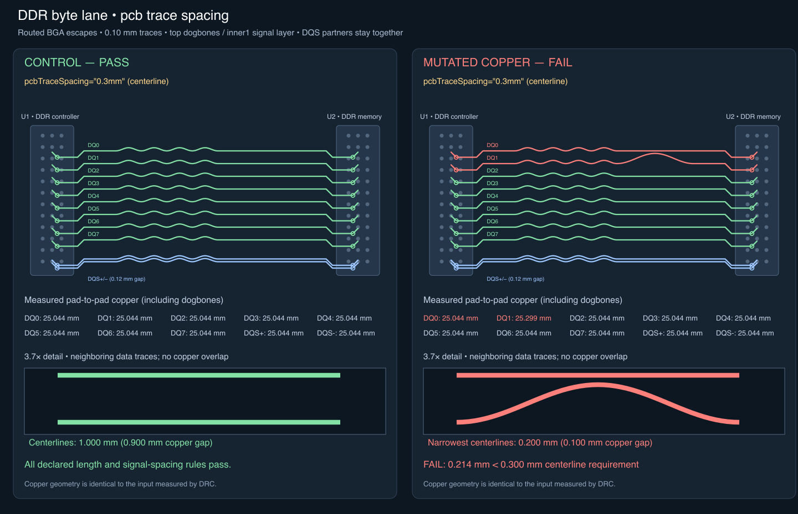
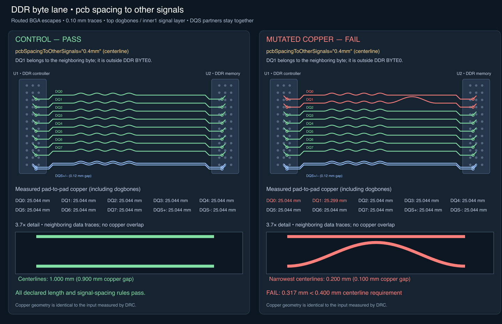

# Routed DDR constraint snapshots

These deterministic byte-lane coupons show eight data signals and a close DQS
pair between BGA packages. Every signal is connected pad to pad through two
layer-changing dogbones. Signal copper uses 45-degree approaches and rounded
meanders on inner1. The fixtures are authored routed Circuit JSON, not a saved
AM3352 autorouter plan or a solver quality/performance test.

Each image compares a passing control with a mutation of its copper. Endpoint
positions, dogbones, layers and strobe pairing are retained. The snapshots render
the same route points the checker measures, highlight referenced copper, and
show measured values alongside the corresponding bus props. Tests require every
route to remain measurable and complete and every finding to use the intended
rule. Length measurements are also compared with independent polyline sums.

## Length skew

One enlarged, smooth tuning lobe makes DQ0 longer than the other data/strobe
members. The comparison includes the strobe without changing bus membership.

## Minimum length

Removing DQ0's tuning lobes makes it shorter than the declared minimum.

## Maximum length

Enlarging DQ0's tuning lobe exceeds the declared maximum.

## Target length tolerance

The same detour moves DQ0 outside the target window.

## Internal signal spacing

A misplaced DQ1 tuning bulge approaches DQ0. It does not short: the narrowest
centerline separation is 0.200 mm with 0.100 mm wide copper. The required
centerline spacing is 0.300 mm. The checker reports a violating segment witness,
which can be greater than the narrowest distance; its exact measured value is
printed beneath the magnified copper view.

## Spacing to other signals

DQ1 is excluded from the byte bus to represent an adjacent byte lane. Its bulge
violates the 0.400 mm external centerline spacing requirement. The checker must
include copper outside the bus and identify the other trace.

These images validate geometric rules. Impedance intent errors and unverified
physical impedance warnings are covered by separate tests; copper appearance
alone cannot demonstrate actual impedance or DDR electrical compliance.

SVG regression snapshots live in `tests/lib/__snapshots__/ddr-routing-*.snap.svg`.
The PNGs here are rasterizations of those SVGs for review on GitHub.
