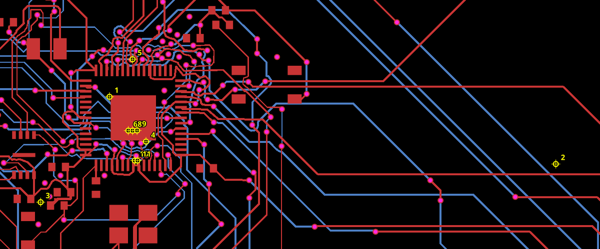

# Game Boy Advance clearance marker reproduction

The fixture comes from `gameboy-advance (1).json`. It retains PCB board, group, component, port, pad, via and trace records; source connectivity records; and all 12 exported errors. Schematic graphics, CAD, solder paste, silkscreen, pours, courtyards and warnings are omitted because these checks do not consume them. No retained coordinates or routes were changed.

Run `bun test tests/repros/gameboy-clearance-locations.test.ts`. The checks run on geometry with stored errors removed, then compare all 11 generated clearance errors (except IDs reassigned by core) with the supplied errors. The snapshot records exact floating-point coordinates. Units below are millimeters in PCB coordinates (positive y is up).

| # | Objects | Current x | Current y | Clearance |
| --- | --- | ---: | ---: | ---: |
| 1 | `pcb_smtpad_39` / `source_net_10_mst2_0` | -1.7875249999999998 | 18.5875 | 0.0829015425698356 |
| 2 | `pcb_smtpad_52` / `source_trace_185_0` | 31.687516499999997 | 13.524889000000002 | 0.08686571259475916 |
| 3 | `pcb_smtpad_100` / `source_trace_134__source_net_1_mst2_0` | -6.95 | 10.650000000000002 | 0.08999816906738296 |
| 4 | `pcb_smtpad_41` / `source_trace_47__source_trace_51_mst1_0` | 0.9499599999999997 | 15.212467 | 0.08379583717334825 |
| 5 | `pcb_via_225` / `source_trace_65_0` | -0.05504999999999949 | 21.4125385 | 0.09408143978222645 |
| 6 | `pcb_via_2` / `pcb_smtpad_0` | -0.3766236537458161 | 16.037627999999998 | 1.4000000003733248e-06 |
| 7 | `pcb_via_8` / `pcb_smtpad_0` | -0.3766236537458161 | 16.037627999999998 | 1.4000000003733248e-06 |
| 8 | `pcb_via_184` / `pcb_smtpad_0` | -0.054712791537055314 | 16.032666524473438 | 0.00992435105312417 |
| 9 | `pcb_via_192` / `pcb_smtpad_0` | 0.2804438683131409 | 16.049947684856793 | 0 |
| 10 | `pcb_via_225` / `pcb_smtpad_8` | 0.10874863258521934 | 13.78345420308527 | 0.07796434298802002 |
| 11 | `pcb_via_225` / `pcb_smtpad_7` | 0.30877363258521934 | 13.78345420308527 | 0.06619877377773697 |

Rows 1–5 use the midpoint of the full trace endpoints, regardless of the violating segment. Rows 6–11 use the midpoint of via and pad centers, which puts near-edge violations inside larger pads. Rows 6 and 7 coincide because the supplied vias have identical positions.

The twelfth error is `via_in_pad_pcb_via_192_pcb_smtpad_0`: via copper at (0.56, 15.10) overlaps U1.GND at (0, 17). It has **no marker coordinate** in either the export or the check output. The installed circuit-json `PcbPlacementError` schema has no location field; adding a positional marker for that error requires a schema/renderer change outside this repository. Its text location is reproduced separately.
