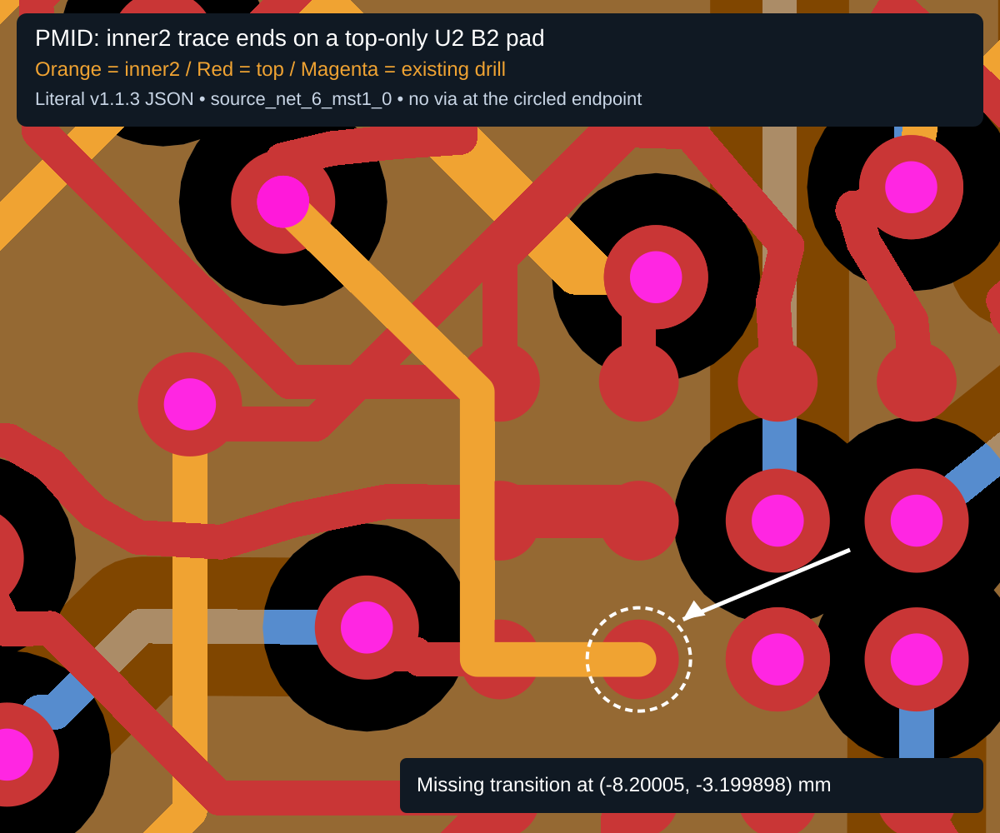

# Pedometer v1.1.3: inner-layer endpoint accepted on a top-only pad

The literal published board contains a PMID trace ending on `inner2` directly
under U2's top-only B2 pad, without a via. The current checks miss this connection
error. The original reproduction is retained below as historical evidence.
The regression now passes with layer-aware trace/port attachment checking; this
is not a hardware repair recommendation.

## Source and fixture integrity

- Design: https://tscircuit.com/imrishabh18/pedometer#pcb
- Release: **1.1.3**, release ID `1c7b0745-f622-4f7d-8d72-542968f288fb`.
- File: https://tscircuit.com/imrishabh18/pedometer/blob/review/circuit.json
- Retrieved September 24, 2026 from that release's `content_text`.
- Fixture: `tests/assets/pedometer-v1.1.3-missing-via.circuit.json`.
- SHA-256: `384dff968fe32973bb6b1736216a0d754ce44283f269d087da7546204ef430cd`.
- Size: 2,311,245 bytes. The complete JSON is preserved verbatim: no regeneration,
  trimming, route correction, schema normalization, or formatting.
- Checks baseline: commit `ddb85a0`, package version `0.0.117`.

The hash test intentionally prevents accidental replacement with a newly routed
board. Clone the fixture before checks because the port checker can mutate routes.

## Exact location

| Item | Value |
| --- | --- |
| Net | `PMID` / `source_net_6` |
| PCB trace | `source_net_6_mst1_0` |
| Source trace | `source_trace_83` (`.U2 > .pin20 to net.PMID`) |
| Target port / pad | `pcb_port_66` / `pcb_smtpad_66` |
| Component | U2, BQ25150, B2 / logical pin 6 (`PMID_B`) |
| Coordinate | x = -8.20005 mm, y = -3.199898 mm |
| Arriving layer | `inner2` |
| Pad and port layer | `top` only |

The route starts at U2 VINLS (`pcb_port_80`), travels on top, changes to inner2
through the real via at (-9.224567805024478, -1.8811807033690149), and ends:

```json
[
  { "route_type": "wire", "x": -8.665457950901502, "y": -3.2, "width": 0.1, "layer": "inner2" },
  { "route_type": "wire", "x": -8.2, "y": -3.2, "width": 0.1, "layer": "inner2" },
  { "route_type": "wire", "x": -8.20005, "y": -3.199898, "width": 0.1, "layer": "inner2", "end_pcb_port_id": "pcb_port_66" }
]
```

The endpoint's x/y and `end_pcb_port_id` match the pad, but its layer does not.
The tests inspect **all** standalone vias and route-via entries: none is within
0.01 mm of this endpoint. The existing via at the other end is retained and
asserted. A top trace (`source_net_6_mst0_0`) also touches B2; that does not connect
the inner2 copper through the board dielectric.

## Behavior at the original reproduction baseline

1. `checkEachPcbPortConnectedToPcbTraces` skips source traces with fewer than two
   source ports. This source trace has one port (`source_port_80`) and one net.
   Its `connectsTo` / endpoint port metadata is not a physical layer connection.
2. `checkTracesAreContiguous` returns **zero errors for this entire fixture**.
   It checks the source trace's expected port (the start at VINLS), rather than
   requiring the opposite endpoint to be physically connected. Its pad containment
   helper also checks only x/y, not copper layer. Enabling this function alone
   therefore does not solve the repro.
3. `runAllRoutingChecks` has the continuity check commented out. It returns 40
   other errors on this baseline, but no trace/port connectivity error for the
   missing-via endpoint. This is **not** a claim that the current aggregate check
   returns zero errors or reproduces the viewer's displayed error count.

## Original reproduction tests and visual evidence

Run:

```sh
bun install
bun test tests/lib/pedometer-missing-via.test.ts
bunx tsc --noEmit
bun test
```

On this machine the old Sharp dependency required `npm rebuild sharp` after Bun
blocked its install script. No dependency or lockfile change is included.

At the reproduction baseline, the focused file had eight tests: fixture checksum, exact geometry and missing
via evidence, checker execution smoke tests, an in-memory valid-via control,
three expected-failure tests, and the visual snapshot. `test.failing` means the
three desired diagnostic assertions currently fail as expected; these are not
claims that DRC has been fixed. Removing `.failing` gives **three assertion
failures (expected true, received false)**. Smoke tests separately ensure that
exceptions from a checker cannot masquerade as the expected diagnostic failures.

The control adds a via and top-layer landing at the endpoint in a clone only,
checks that it does not produce a connectivity error, and verifies that the
literal fixture remains unchanged. It is not an instruction to modify hardware.



The snapshot renders the full literal JSON with a world-coordinate viewport:
x [-9.7, -7.5], y [-3.7, -1.3] mm, and explicit SVG
`viewBox="0 0 1200 1000"`. Silkscreen is hidden to keep the copper legible.
The literal inner2 route is drawn again above the top copper for layer visibility;
no copper geometry is invented or moved. Orange is inner2, red is top, magenta
marks existing drills. The white arrow and dashed circle are explanatory
annotations, **not an error emitted by the current checker**.

Original validation: 8 focused tests pass (including 3 expected failures); all 105 tests
across 54 files pass; TypeScript and formatting of the new test pass. The three
unwrapped diagnostic assertions were also run and each failed as expected.

## Hardware context and limits

Reported readings were C3 = 5 V, C4 = 5 V, C5 = 1.8 V, C9 approximately 0.22 V,
and C10 = 0 V, with open-circuit resistance between C4's and C9's PMID pads.
This JSON defect matches the supplied PCB viewer screenshot. It does not alone
prove the cause of every measured hardware disconnection: the manufactured
Gerbers, chip-internal paths, assembly, and other routes require separate review.


## Fix and current regression coverage

The shared `trace-port-layer-connectivity` helper validates each explicit wire-to-port
attachment against the actual pad layers (or the port layers for port-only data).
A cross-layer attachment needs a physical via that touches the endpoint copper
and the target pad and spans both layers. Standalone vias and route-only vias are
supported; emitted barrel spans override route declarations. Plated pads retain
their emitted layers. A via on a different net still represents physical copper
contact; short-circuit checks remain responsible for reporting that separate fault.

Both the port checker and continuity checker report missing attachments, including
the exact endpoint coordinates and affected port/component. The indexed PCB
connectivity map rejects those false port edges too. This closes the metadata gap
without changing the literal fixture, inferred IDs, or unrelated same-layer
connectivity behavior. It does not replace the general route-continuity checks.

All three original `test.failing` cases are now ordinary regression assertions.
The zoomed snapshot includes the real continuity error returned by the checker;
its arrow and layer overlay remain explanatory annotations. The test asserts the
error's center and port/component IDs before rendering it.

The additional focused controls cover same-layer pads, standalone and owned vias,
buried/wrong-span vias, lateral gaps, via-to-pad contact, non-plated holes,
port-only input, actual pad layers overriding broad port metadata, plated holes,
route-only barrel spans, emitted-via precedence, start endpoints, duplicate
references, and a valid neighboring trace that must not excuse the bad attachment.
