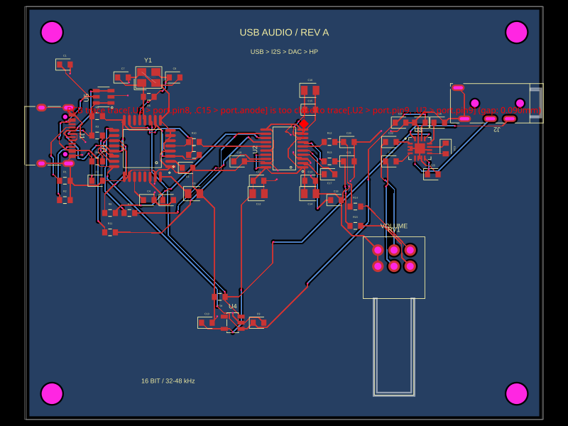

# USB audio DAC: routing DRC aborts before returning a clearance error

Run from the repository root:

```sh
bun install
bun test tests/repros/usb-audio-dac-routing-drc-crash.test.ts
```

The fixture is the **complete captured board**, including all components,
source nets, routed traces, vias, ground pour and schematic data. It is an
earlier failing revision of an 80 × 64 mm USB audio DAC/headphone amplifier,
not the subsequently corrected board. Keeping the generated Circuit JSON
avoids network part lookup and autorouter changes hiding the original geometry.
No mock checker, synthetic copper bridge or simplified board is used.



The first test runs the trace-clearance check independently. It finds the
0.090 mm gap between `source_net_21_mst7_0` (3.3 V) and
`source_net_0_mst0_0` (GND), below the check's 0.100 mm minimum. The full-board
snapshot includes that error marker. This is a clearance violation, not proof
of an electrical short.

The second test describes the expected behavior: the routing-check batch
returns that error. It is marked `test.failing` because the current batch
instead throws from `checkCopperPourShorts`:

```text
Error: source_net_9_mst2_0: Unresolved boundary conflict in boolean operation
```

Remove `.failing` to see the ordinary failing test. After fixing the bug,
remove `.failing` permanently; an unexpected pass should fail this repro.
The crash occurs on a different trace from the missed clearance violation.

## Relationship to the successful CLI build

The original build used tscircuit 0.0.2646, core 0.0.1971, checks 0.0.208,
CLI 0.1.2168 and Bun 1.3.14. Its log showed this exception in
`PcbDesignRuleChecks`, followed by `Circuits 1 passed` and exit code 0.
The geometry exception and aborted batch also reproduce on this repository's
current source (checks 0.0.222).

This repro belongs in `tscircuit/checks` because it exercises the real check
batch directly. It does **not** assert CLI exit status or fix core's handling
of asynchronous checker failures; those are a separate integration concern.
No production code or dependencies are changed.
